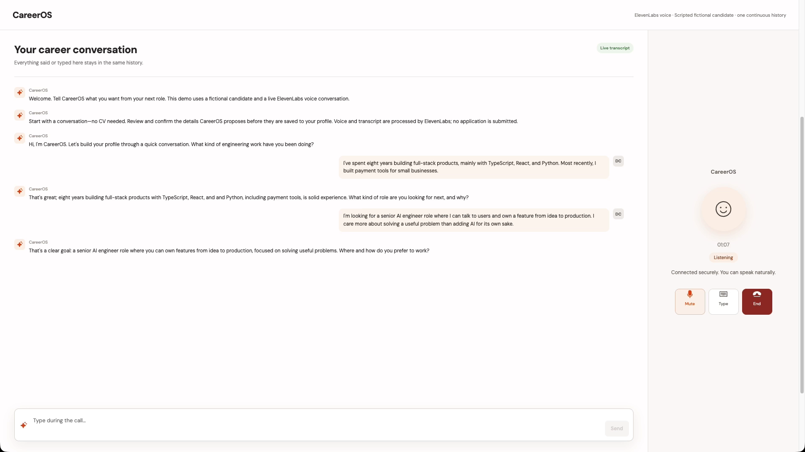

# CareerOS

A career conversation becomes a profile the candidate can inspect and control. CareerOS asks about experience, goals and working preferences, proposes details with supporting quotes, and saves only what the candidate confirms.

[Watch the product walkthrough (4:03)](docs/demo/walkthrough.mp4) · [Architecture and review guide](docs/ARCHITECTURE.md) · [Demo notes](docs/DEMO.md)



## Problem

A CV describes past work but often misses what someone wants next. Turning a conversation into a useful profile can introduce assumptions that the candidate never agreed to.

## Why it matters

Candidates need to correct the wording and decide what gets saved. A career tool should keep the supporting evidence close to each suggestion.

## Solution

Start a voice conversation without uploading a CV. Review the extracted details beside quotes from the conversation, edit them, confirm individual items and save the profile. The surrounding workspace demonstrates role comparison, CV preparation and application tracking with fictional data.

## Architecture

React and Vite serve the interface. Local Node middleware obtains a short-lived ElevenLabs session token using server-side credentials. The React SDK opens a WebRTC conversation. A client tool validates proposed facts against the transcript; separate browser-storage records hold pending and confirmed details.


## AI / agent design

The agent asks one question at a time and invokes `propose_profile_facts` after gathering enough information. Six fields are allowed: target role, experience, skills, location, working style and motivation. Unsupported fields, repeated fields, empty values and quotes absent from a candidate turn are rejected. A successful tool call creates a pending proposal, not a confirmed profile.

The voice conversation and extraction are live when configured. Opportunity discovery and fit scores are fixtures, CV preparation uses templates, and the general assistant is disconnected. Confirmed voice-profile facts are not yet connected to matching or CV generation. No multi-agent orchestration or model routing is claimed in this implementation.

## Key tradeoffs

- Quote matching checks where a suggestion came from; it does not prove that the interpretation is correct. The candidate reviews the meaning.
- Explicit confirmation adds a step but prevents automatic profile updates.
- Local storage keeps the prototype easy to inspect, without account synchronization or secure multi-user storage.
- Fictional fixtures make the surrounding workflow reproducible without requiring live job sources.

## Production considerations

The local token endpoint rejects foreign origins and missing action headers, keeps credentials server-side and returns generic errors. A public service still needs authentication, authorization, rate limiting and abuse controls.

ElevenLabs processes voice and transcript. The agent template requests seven-day retention; verify effective provider settings before using real information. Browser storage retains conversation history and pending evidence as well as confirmed facts. See [data handling](docs/DATA.md) for reset instructions and boundaries.

Further work includes consent and deletion controls, account storage, extraction evaluations, cross-call context and connecting confirmed facts to downstream workflows. This repository is a working local prototype, not a deployed recruiting service.

## How to run

Use **Node 22.22 or later**. With nvm, run `nvm install` and `nvm use` in this directory.

```sh
npm ci
npm test
npm run build
npm run dev
```

Open `http://127.0.0.1:3002`. The fictional opportunity workflow works without credentials.

To enable voice:

1. Create a private ElevenLabs agent using `voice-agent-config.json` as a template. Replace the stock-voice placeholder with an available voice and keep authentication enabled.
2. Configure `propose_profile_facts` as a blocking client tool that waits for its result.
3. Copy `.env.example` to `.env` and set your API key and agent ID. The key needs conversational-agent access. Never use a `VITE_*` variable for credentials.
4. Restart `npm run dev`, open **Profile → Open conversation → Start a conversation**, and allow microphone access.

The development server loads `.env` into its server process. Calls use the configured provider account. Without configuration, the call reports an error and leaves the profile unchanged. `npm run preview` serves static assets only and does not provide the voice endpoint.

## Demo

The [walkthrough](docs/demo/walkthrough.mp4) shows a fictional candidate speaking through a stock synthetic voice. The agent's replies and proposed facts were generated during the call. Five details were confirmed, including a wording correction, and persisted after reload. The opportunity portion uses a separate fictional baseline profile. No application is submitted.

The repository includes source, tests, synthetic fixtures, sample PDFs and the demo. Credentials, personal datasets, browser sessions, internal planning material and prior repository history are excluded.
